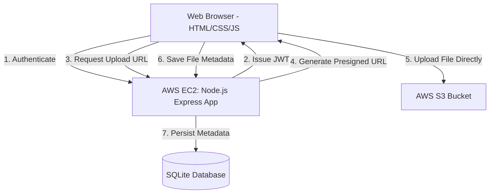

# Cloud-Based File Storage & Sharing System

This document outlines the implementation plan for developing a secure, modular, and scalable File Storage & Sharing System. The application allows users to authenticate, upload/download files via AWS S3 presigned URLs, generate shareable links with optional expiry times, and view storage usage metrics.

To ensure efficient execution and separation of concerns, the project is divided into three distinct roles for a **3-member team**:
1. **Developer 1 (Frontend & UI/UX)**: Responsible for building the user interface, authentication forms, dashboard, upload/download flows, sharing interfaces, and usage charts.
2. **Developer 2 (Backend & API)**: Responsible for building the Node.js/Express server, database schemas, authentication (JWT), AWS S3 integration (presigned URLs), sharing link validation, and monitoring API endpoints.
3. **Developer 3 (DevOps & Cloud Infrastructure)**: Responsible for setting up AWS S3, CORS, EC2 hosting, PM2 process management, Nginx reverse proxying, secure environmental configs, SSL setup, and deployment automation.

---

## User Review Required

> [!IMPORTANT]
> **AWS Free Tier Limitations & Architecture Decisions**
> 1. **Database Selection**: To stay strictly within the AWS Free Tier, we propose using a **local SQLite** database or a containerized PostgreSQL database directly on the EC2 instance (rather than a separate AWS RDS instance, which is free only for 12 months and can easily incur costs if misconfigured). Please let us know if you prefer a separate RDS instance instead.
> 2. **SSL Certificate**: We plan to use **Let's Encrypt (Certbot)** for free SSL certificates. This requires a domain name (or a free dynamic DNS like DuckDNS/No-IP). If you do not have a domain, we can access the app via HTTP on the EC2 IP/DNS during testing, but modern browser features (like secure cookies) work best over HTTPS.
> 3. **Direct-to-S3 Uploads (Presigned URLs)**: To prevent bottlenecks on the single CPU EC2 instance (`t2.micro`/`t3.micro`), files will be uploaded *directly* from the client browser to AWS S3 using presigned URLs. This is highly performant and secure.

---

## Open Questions

> [!WARNING]
> **Key Decisions Needed Before Coding Begins**
> 1. **Storage Limits**: Do you have a specific storage quota per user in mind (e.g., 100MB for testing, up to S3's 5GB free tier limit)?
> 2. **Authentication Flow**: Do you prefer simple Username/Password auth with JWT cookies, or would you like to plan for OAuth (e.g., Google Sign-In) in the future? We recommend standard JWT cookie-based auth for simplicity and statelessness.
> 3. **Sharing Security**: Do shared links require passcode protection, or is a unique cryptographic token with expiration sufficient?

---

## System Architecture



---

## Collaboration Strategy

To ensure seamless integration and parallel development without blockers, the team will follow this collaboration workflow:

### 1. Git Workflow & Branching
*   **Branches**:
    *   `main`: Contains stable, production-ready code. Deployed to EC2 by Developer 3.
    *   `develop`: The shared integration branch. Developer 1 and Developer 2 merge completed feature branches here.
    *   `feature/*` / `infra/*`: Individual branches created for specific milestones (e.g., `feature/auth-ui`, `feature/s3-api`, `infra/ec2-setup`).
*   **Pull Requests (PRs)**:
    *   No direct commits to `main` or `develop`.
    *   Every PR requires at least one peer approval. For example, Developer 1 reviews Developer 2's API changes to ensure the frontend can consume them easily.

### 2. API Contract-First Development
To prevent Developer 1 from being blocked by Developer 2's backend implementation:
*   On **Day 1**, both developers agree on a JSON payload contract (e.g., schemas for logins, file lists, and S3 upload requests).
*   Developer 1 uses local mock data mimicking these schemas to build the UI components in parallel.
*   Developer 2 writes the corresponding controller code matching the schema contract.

### 3. Infrastructure & Config Sharing (DevOps Bridge)
*   **Secret Management**: Avoid checking secret files (`.env`, database files, AWS private keys) into Git. Create a `.env.example` file.
*   **S3 Credentials**: Developer 3 sets up the S3 bucket, configures CORS, generates a restricted IAM user policy, and provides Developer 2 with the access keys securely (e.g., via a encrypted communication channel).
*   **Deployment Handoff**: Developer 2 provides a production run script (`npm start` or Node entry point). Developer 3 uses PM2 to run and daemonize this script on the EC2 instance.

---

## Proposed Changes

We will organize the repository with a clean separation of frontend, backend, and database logic:
```
/
├── backend/
│   ├── config/
│   │   ├── aws.js
│   │   └── db.js
│   ├── controllers/
│   │   ├── authController.js
│   │   ├── fileController.js
│   │   └── shareController.js
│   ├── middleware/
│   │   └── authMiddleware.js
│   ├── models/
│   │   └── schema.sql
│   ├── routes/
│   │   ├── auth.js
│   │   ├── files.js
│   │   └── share.js
│   ├── server.js
│   └── package.json
└── frontend/
    ├── public/
    │   ├── css/
    │   │   └── styles.css
    │   ├── js/
    │   │   ├── api.js
    │   │   ├── auth.js
    │   │   └── dashboard.js
    │   └── index.html
    └── dashboard.html
```

---

## Division of Labor & Milestones

### 👤 Developer 1: Frontend & UI/UX

*   **Milestone 1: Design System & Styling Foundations**
    *   Create [styles.css](file:///c:/weinternjun26/week3minorproject/frontend/public/css/styles.css) with a modern premium design system (CSS Custom Properties for dark theme, glassmorphism, Inter typography).
    *   Incorporate CSS micro-animations for buttons, upload progress indicators, and transitions.
*   **Milestone 2: Authentication Screens**
    *   Create login and registration layouts in [index.html](file:///c:/weinternjun26/week3minorproject/frontend/public/index.html).
    *   Implement client-side validation and authentication API requests in [auth.js](file:///c:/weinternjun26/week3minorproject/frontend/public/js/auth.js).
*   **Milestone 3: File Dashboard & Operations**
    *   Build [dashboard.html](file:///c:/weinternjun26/week3minorproject/frontend/dashboard.html) displaying file grid, upload progress bar, search/filter panel, and storage usage visualization.
    *   Write client-side file upload flow in [dashboard.js](file:///c:/weinternjun26/week3minorproject/frontend/public/js/dashboard.js) which requests a presigned URL and uploads the file directly to S3 via standard HTTP `PUT`.
    *   Build a modals UI for generating shared links, setting expiration times, and deleting files.

---

### 👤 Developer 2: Backend & API Development

*   **Milestone 1: Server Setup & Database Schema**
    *   Initialize [package.json](file:///c:/weinternjun26/week3minorproject/backend/package.json) and set up the Express server in [server.js](file:///c:/weinternjun26/week3minorproject/backend/server.js).
    *   Write SQLite database migration file [schema.sql](file:///c:/weinternjun26/week3minorproject/backend/models/schema.sql) defining tables for `users` (hashed passwords), `files` (S3 key, name, size, type, owner_id), and `shares` (uuid, file_id, expires_at, view_count).
*   **Milestone 2: Authentication & File Metadata APIs**
    *   Implement user registration, login, and token generation/verification (using JWT stored in HTTP-only cookies).
    *   Implement GET `/api/files` (list user's files) and DELETE `/api/files/:id` (remove metadata from DB and delete S3 object).
    *   Create a file metadata endpoint to calculate storage usage per user.
*   **Milestone 3: S3 Integrations & Shareable Link Engine**
    *   Configure AWS SDK in [aws.js](file:///c:/weinternjun26/week3minorproject/backend/config/aws.js).
    *   Implement POST `/api/files/upload-url` to generate S3 PUT presigned URLs for client-side uploads.
    *   Implement GET `/api/files/download-url/:id` to generate S3 GET presigned URLs for file downloads.
    *   Implement sharing endpoints: POST `/api/shares` to generate public links, and GET `/share/:token` to validate tokens, enforce expiration, and redirect the browser to download.

---

### 👤 Developer 3: DevOps & Infrastructure

*   **Milestone 1: AWS Resource Provisioning**
    *   Provision an AWS S3 bucket. Configure Block Public Access to be enabled.
    *   Configure the S3 Bucket CORS policy to allow uploads from local development origins and the production EC2 URL:
        ```json
        [
          {
            "AllowedHeaders": ["*"],
            "AllowedMethods": ["PUT", "GET"],
            "AllowedOrigins": ["http://localhost:3000", "http://your-ec2-ip"],
            "ExposeHeaders": []
          }
        ]
        ```
    *   Provision an AWS EC2 instance (`t2.micro` or `t3.micro` under the Free Tier) running Ubuntu LTS.
*   **Milestone 2: Server Setup & Hardening**
    *   Configure AWS Security Groups to expose port 22 (SSH), port 80 (HTTP), and port 443 (HTTPS) while blocking all internal ports.
    *   Install Node.js, Git, SQLite3, and PM2 on the EC2 instance.
    *   Deploy code to the server, configure PM2 to keep the Node.js process running, and set up systemd to restart PM2 on boot.
*   **Milestone 3: Reverse Proxy & Nginx Configuration**
    *   Install and configure Nginx as a reverse proxy, mapping port 80/443 to the local Node.js application (e.g. port 3000).
    *   (Optional but highly recommended) Install Certbot to generate and auto-renew Let's Encrypt SSL certificates.
    *   Set up automated backup scripts or basic AWS CloudWatch alarms for monitoring server performance and memory limits.

---

## Verification Plan

### Automated Tests
*   `npm run test`: Implement core API integration tests using Supertest/Jest to verify registration, login, JWT authorization middleware, and SQLite DB queries.

### Manual Verification
1.  **Direct-to-S3 Upload Test**: Verify S3 CORS blocks unauthorized domains and allows proper client uploads without exposing server AWS secrets.
2.  **Expirable Links Verification**: Create a shared link expiring in 1 minute. Verify access is allowed within 1 minute, and throws a 410 Gone / 404 Not Found error after expiration.
3.  **Deployment Verification**: Test that the web application runs continuously behind PM2, survives server reboots, and routes external traffic properly through Nginx.
